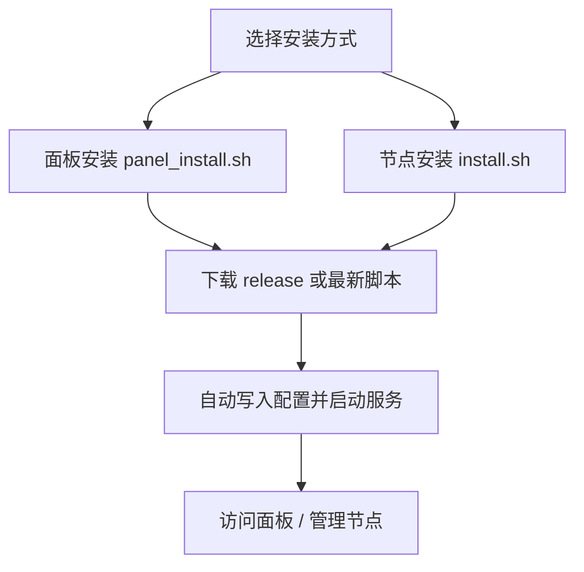

# FLVXT2

[](https://github.com/iKeilo/flvxt2/releases)
[](LICENSE)
[](https://github.com/iKeilo/flvxt2/actions)
[](https://github.com/orgs/iKeilo/packages)

> 基于 `go-gost` 的流量转发管理系统，包含 Go 后端、Vite/React 前端和 Go 节点代理。

## 项目特点

- 支持 `TCP` 和 `UDP` 转发
- 支持 `端口转发` 和 `隧道转发`
- 支持按用户、节点、分组进行权限和流量管理
- 支持节点分组、节点标签、流量统计和重置
- 支持 `gost` 和 `nftables` 两种运行模式
- 支持面板和节点一键安装、升级、Release 下载

## 安装示意



### 1. 面板端安装

```bash
curl -L https://raw.githubusercontent.com/iKeilo/flvxt2/main/panel_install.sh -o panel_install.sh && chmod +x panel_install.sh && ./panel_install.sh
```

### 2. 节点端安装

```bash
curl -L https://raw.githubusercontent.com/iKeilo/flvxt2/main/install.sh -o install.sh && chmod +x install.sh && ./install.sh
```

### 3. 指定版本安装

从 Release 页面复制对应版本命令即可，例如：

```bash
curl -L https://github.com/iKeilo/flvxt2/releases/download/3.0.0/panel_install.sh -o panel_install.sh && chmod +x panel_install.sh && ./panel_install.sh
```

```bash
curl -L https://github.com/iKeilo/flvxt2/releases/download/3.0.0/install.sh -o install.sh && chmod +x install.sh && ./install.sh
```

## Release 与 Packages

- Release 页面：<https://github.com/iKeilo/flvxt2/releases>
- 源码仓库：<https://github.com/iKeilo/flvxt2>
- Docker Packages：
  - `ghcr.io/ikeilo/flvx-svc-backend`
  - `ghcr.io/ikeilo/flvx-svc-frontend`

## 快速开始

- [部署流程](./doc/install.md)
- [使用说明](./doc/usage.md)
- [PostgreSQL 指南](./doc/postgresql.md)
- [常见问题](./doc/faq.md)
- [AI Skill 接入](./doc/ai-skill.md)

## 默认账号

- 用户名：`admin_user`
- 密码：`admin_user`

首次登录后请立即修改默认密码。

## 目录说明

- `go-backend`：面板后端
- `vite-frontend`：管理前端
- `go-gost`：节点代理运行时
- `doc`：部署与使用文档
- `scripts`：发布与构建脚本

## 免责声明

本项目仅供学习、研究和合法合规用途使用。部署和使用者需自行确保符合所在地法律法规，并承担相应风险。
